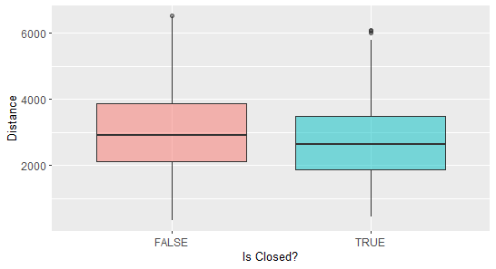

# Toronto Cafe Closures

## Introduction

One of the prime considerations for any business owner looking to launch a new store is location. A great location includes an ample local consumer-base, easy accessibility, affordable rent or cost of space and low competition from other similar establishments. We analyze spatial variables to study their impact on the success of coffee shops or cafes in the city of Toronto. By studying the factors that influence success or failures, we can help avoid financial losses, suggest optimal resource allocation and enable informed decision-making for prospective business owners. More specifically, the goal of this work was to predict store closures and develop a strategy for identifying optimal locations for opening new cafes. We downloaded and scraped relevant spatial data such as a list of open cafes from 2020 [Kaggle](https://www.kaggle.com/datasets/kevinbi/toronto-restaurants). The ground truth or label indicating whether the store is open or closed today was obtained from scraping Google search results for each store. We then engineered features such as whether the cafe was a chain or not, proximity of the cafes to Toronto downtown and subway stations, availability of other cafes and restaurants nearby (both chain and non-chain cafes), availability of parking lots nearby and estimated rent of commercial space around the stores. We trained a spatial model to predict store closures from the features. Lastly, we scraped locations of available commercial properties up for sale in the city and recommended a few spots that our model predicts to be optimum for opening a cafe. 

## Data Sources

* __Toronto Restaurants:__ This dataset contains information about 12,227 open restaurants
in Toronto including the restaurant name and 125 cuisine types (Afghan, Café, Mexican etc.). The dataset is from the year 2020 and we filtered our dataset to include cafes (ncafes = 453) only. The cafe subset included 374 non-chain/independent cafes
and 79 chain cafes such as Aroma Espresso Bar, Delimark Cafe, Starbucks and Tim
Horton's. Spatially, the cafes were more concentrated in the Old Toronto area which
includes downtown (165 cafes in 120 km2 area) and more spread out in the rest of the
city (258 cafes in 544 km2 area). Additionally, since the Kaggle dataset was 4 years old, we gathered the labels by
programatically looking up the name and address of each restaurant on Google and
searching for the phrase ‘permanently closed’ in the html text. The location of open
and closed cafes throughout the city and a closer look at downtown
region are shown in figure below. In total, the cafes in the city experienced a 27% closure rate
in the past 4 years.

* __Toronto Commercial Listings for Lease:__ The Toronto commercial listings data
was obtained from the Zolo website [Zolo](https://www.zolo.ca/toronto-real-estate/commercial-for-lease). We scraped details including rental address and price per square feet for 644 listings in the city. We converted the address information
to longitude and latitude information using the Geodata API. The rents ranged from
$1 to $900 per square feet with an average of $34 in downtown and $21 in the rest of
Toronto. We will later test the viability of these locations for opening new cafes. The figure below shows the available commercial listings in the city.

* __Toronto Population Data:__ The dataset contains information about the population
of Toronto divided into small blocks along with their spatial information [Open Canada](https://open.canada.ca/data/en/dataset/32f1a777-9fcf-4e4a-8c66-82c66a2e76f1). This provides us with an estimate of the number of customers available locally around each cafe.

* __Open Street Map (OSM) Data:__ We also pulled data from the OpenStreetMap. The
relevant data is mentioned below.

  – __Toronto subway, streetcar and city bus stations:__ Contains information
about the subway, street car and bus stops in the city. In total there were 7118
such stops most of which were located along the streets of Toronto. For illustration, we can see the arrangement of public transport stops in downtown below.

  – __Downtown Boundary:__ This boundary defines Old Toronto and allows for comparisons
between downtown and other regions.

  – __Parking Lots:__ Contains longitude and latitude of 5400 free parking spots in
Toronto. Free parking space should be associated with greater accessibility increasing
the nearby cafe visits.

  – __Street Network:__ Contains 11045 primary and secondary roads and highways in
Toronto.

  – __Local Attractions:__ Contains locations and shapes of all tourist spots in the city
including zoos, museums, parks, etc. In total there were 94 such spots.

## Methods

### Data pre-processing

Even though the raw dataset contained cafe information in Toronto, there were 150 observations
that were outside the city border (perhaps within the Greater Toronto Area or GTA)
and therefore we dropped them in our analysis. The label for cafes indicating whether they
are closed or not was validated by manually searching the names and addresses of some
randomly closed cafes on Google. Additionally, the cafe name information was in the form
of unstructured text. For example, while identifying chain cafes, the ‘Tim Horton's Cafe’
was incorrectly spelled as ‘Tim Horton’, ‘Tim Horton Donuts’ or ‘Tim Hortons’ in a few
cases. We included every misspelled version of the cafe along with the correct name in the
list of chain cafes. We then used string comparison of each cafe in the dataset to the list of
chains to determine if it was a chain or not.

The commercial property rental dataset contained 380 duplicate values with identical location
and rent and therefore we removed them. Finally, the Toronto population data contained 21,972 values from the GTA and 2 null values
that we dropped from downstream analysis.

### Exploratory Data Analysis

#### Rent comparison between downtown and rest of Toronto
We observe that rents in downtown ($34) are appreciably higher than outer
regions ($20) with statistical significance (p < 2.2e-16). However, the mean rent in areas around
the cafes doesn’t distinguish between open and closed cafes suggesting that rent does not
have significant association with cafe closure.

#### Chain vs. independent cafe
We labelled each cafe in our data whether it is a chain cafe or not with the hypothesis that
chain cafes will be less susceptible to closures. This was validated in our data after performing
chi-square contingency test where we compare the observed vs. expected distribution of
cafe closures in chain vs. non-chain cafes. The discrepancy between the
distributions is statistically significant (p−value = 1E-4). Chain cafes closed at only 9% rate compared to non-chain cafes at 31%.

Observed distribution of closure in chain
vs. non-chain cafes
|                   |  Closed  |  Open |
| :---------------- | :------: | ----: |
| Chain             |   7      | 72    |
| Not-chain         |   116    | 258   |

Expected distribution of closure in chain
vs. non-chain cafes
|                   |  Closed  |  Open |
| :---------------- | :------: | ----: |
| Chain             |   21     | 58    |
| Not-chain         |   102    | 272   |

#### Local competitors
We compared the number of restaurants within a block of each cafe. Our hypothesis was that
the closed cafes may have more restaurants around them giving them tougher competition.
This was validated from our analysis in the figure below, where we see that the closed cafes had
slightly more nearby restaurants (p = 0.02).

## Predictive Modeling
Using our myriad data sources, we engineered features and trained a classification model that predicts if the cafe was closed or open. 

### Feature engineering 
Through our wide collection of datasets, we created the following features:
• Chain cafe (binary): Whether the cafe name is close to ‘Aroma Espresso Bar’, ‘Delimark
Cafe’, ‘Starbucks’ or ‘Tim Horton’s’.

• Number of nearby restaurants (continuous): We created a bounding box of 1 block in
each direction and counted the number of restaurants (including all cuisines).

• Number of nearby parking lots (continuous) using the bounding box method.

• Distance to nearest tourist attraction.

• Number of public transit stops within a block.

• Distance to nearest street.

• Whether the cafe is located in downtown or not.

• Customer density nearby.

• Rental costs of cafes: We used the rent data from Zolo and a grid covering the
Toronto region to interpolate the rental cost across the city. We used the inverse
distance weighting technique for interpolation. The figure below shows
the interpolated rental distribution in the city. The highest rents were at the following places:

  - $900/sqft in 1420 Bayview Ave.
  - $800/sqft in B5-95 State Crown Blvd.
  - $5300/sqft MAIN-369 Eglinton Avenue W.

Lastly, we estimated the cafe rental costs by the rental cost
of the nearest grid point to each cafe.

 
